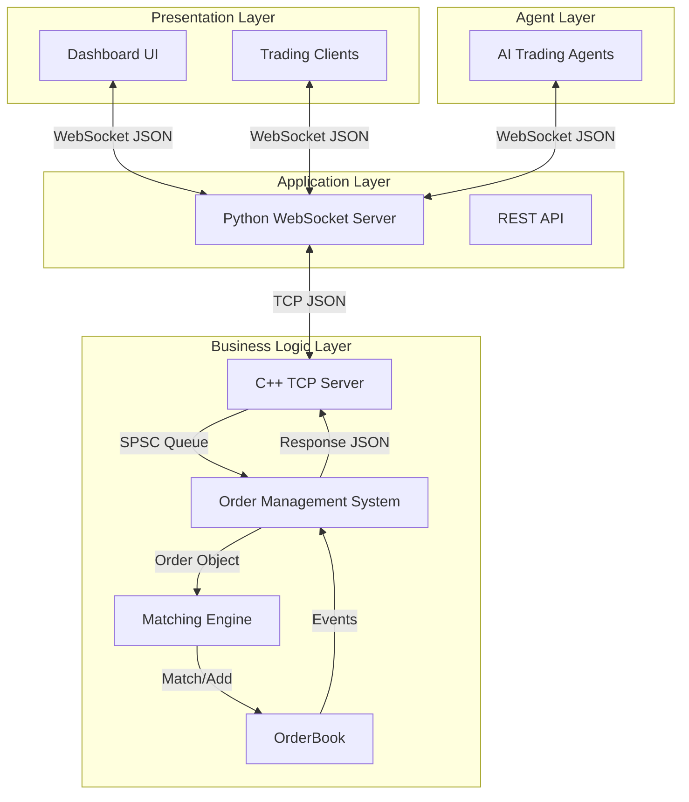
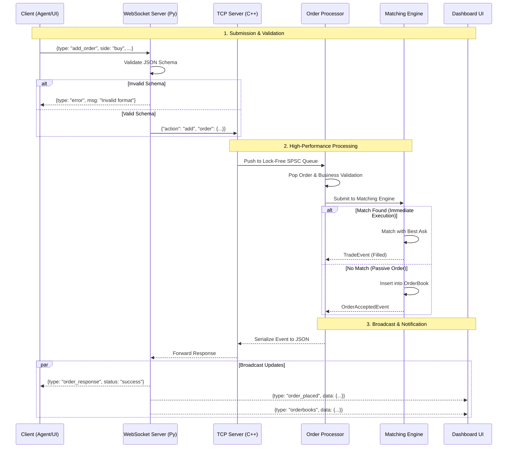
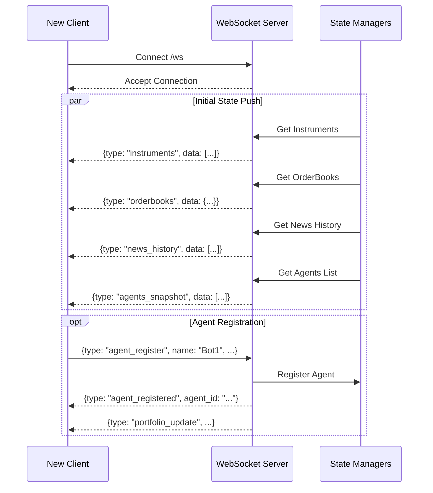
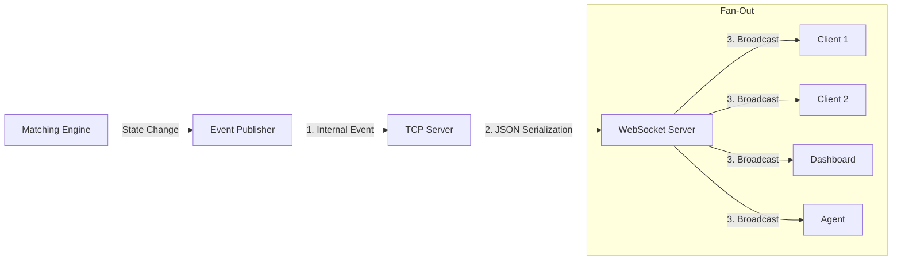
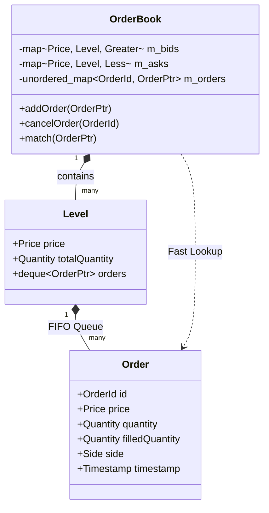
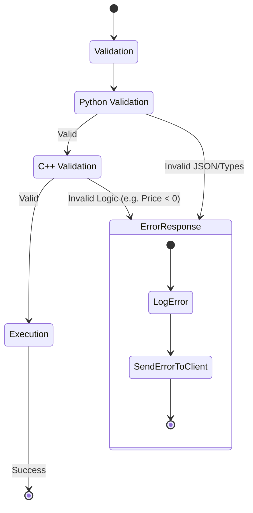

# System Architecture & Data Flow

This document provides a comprehensive visual and textual representation of the OrderBook system architecture, data flows, and component interactions. It is designed to complement the high-level [ARCHITECTURE.md](ARCHITECTURE.md) by focusing on the dynamic behavior of the system.

## 1. High-Level Architecture

The OrderBook system follows a segregated, multi-tier architecture designed for high performance, isolation, and scalability.



### Component Responsibilities

*   **Presentation Layer**: Handles user interaction and visualization. It communicates exclusively via WebSockets.
*   **Application Layer (Python)**: Acts as the gateway. It manages WebSocket connections, performs initial validation, and bridges the external JSON protocol to the internal TCP protocol.
*   **Business Logic Layer (C++)**: The core engine. It executes orders with low latency using lock-free data structures. It is isolated from the network handling of the application layer.
*   **Agent Layer**: Autonomous trading bots that interact with the system exactly like human traders.

---

## 2. Core Workflows

### 2.1 Order Submission Lifecycle

The path of an order from creation to execution is the most critical flow in the system.



### 2.2 Agent Registration & State Sync

How agents and dashboards initialize and stay in sync.



### 2.3 Market Data Broadcast

Efficiently propagating state changes to thousands of clients.



---

## 3. Data Structures & Models

### 3.1 OrderBook Internal Design

The C++ core uses specialized data structures for O(1) and O(log N) performance.



---

## 4. Protocol Messages

### 4.1 WebSocket Messages (Client <-> Server)

#### Client Requests

| Type | Description | Payload Example |
|------|-------------|-----------------|
| `agent_register` | Register a new trading agent | `{"type": "agent_register", "name": "Alpha", "starting_capital": 100000}` |
| `add_order` | Place a new limit/market order | `{"type": "add_order", "symbol_id": 1, "side": "buy", "price": 100, "quantity": 10}` |
| `cancel_order` | Cancel an active order | `{"type": "cancel_order", "symbol_id": 1, "orderId": 12345}` |
| `get_portfolio` | Request current portfolio state | `{"type": "get_portfolio", "agent_id": "..."}` |

#### Server Broadcasts & Responses

| Type | Description | Payload Example |
|------|-------------|-----------------|
| `instruments` | List of tradable instruments | `{"type": "instruments", "data": [{"ticker": "AAPL", ...}]}` |
| `orderbooks` | Full orderbook snapshots | `{"type": "orderbooks", "data": {1: {"bids": [], "asks": []}}}` |
| `order_response` | Ack/Nack for `add_order` | `{"type": "order_response", "data": {"status": "success", "order_id": 123}}` |
| `cancel_response` | Ack/Nack for `cancel_order` | `{"type": "cancel_response", "data": {"status": "success"}}` |
| `order_placed` | Notification of new order (for UI) | `{"type": "order_placed", "data": {"ticker": "AAPL", "price": 100, ...}}` |
| `portfolio_update` | Agent cash/position update | `{"type": "portfolio_update", "cash": 50000, "positions": {...}}` |
| `agents_snapshot` | List of all active agents | `{"type": "agents_snapshot", "data": [...]}` |
| `news` | Real-time news event | `{"type": "news", "data": {"headline": "...", "sentiment": 0.5}}` |
| `news_history` | Historical news items | `{"type": "news_history", "data": [...]}` |

### 4.2 TCP Messages (Internal Python <-> C++)

**Command (Python -> C++):**
```json
{
  "action": "add",
  "order": {
    "id": 12345,
    "price": 10050,
    "qty": 10,
    "side": 1
  }
}
```

---

## 5. Error Handling Flows

How the system manages failures.


