# System Architecture & Data Flow

This document provides a comprehensive visual and textual representation of the OrderBook system architecture, data flows, and component interactions. It is designed to complement the high-level [ARCHITECTURE.md](ARCHITECTURE.md) by focusing on the dynamic behavior of the system.

## 1. High-Level Architecture

The OrderBook system follows a segregated, multi-tier architecture designed for high performance, isolation, and scalability.


### Component Responsibilities

*   **Presentation Layer**: Handles user interaction and visualization. It communicates exclusively via WebSockets.
*   **Application Layer (Python)**: Acts as the gateway. It manages WebSocket connections, performs initial validation, and bridges the external JSON protocol to the internal TCP protocol. Uses connection pooling for efficient TCP communication with the C++ backend.
*   **Business Logic Layer (C++)**: The core engine. It executes orders with low latency using lock-free data structures. It is isolated from the network handling of the application layer. The TCP server uses dependency injection via `IOrderBookService` interface for testability and flexibility.
*   **Agent Layer**: Autonomous trading bots (LLM-enabled when configured, otherwise ML + heuristic strategies) that interact with the system exactly like human traders.

---

## 2. Core Workflows

### 2.1 Order Submission Lifecycle

The path of an order from creation to execution is the most critical flow in the system.


### 2.2 Agent Registration & State Sync

How agents and dashboards initialize and stay in sync.


### 2.3 Market Data Broadcast

Efficiently propagating state changes to thousands of clients.


### 2.4 Dashboard WebSocket Proxy Flow

End-to-end flow for a dashboard browser client connecting via the dashboard WebSocket proxy to the OrderBook server and C++ backend.


### 2.5 Dashboard REST Proxy Flow

Flow for REST calls from the dashboard UI to the OrderBook API (used for instruments, agents, news, performance).


### 2.6 Agents Service Lifecycle & Auto-Spawning

How the separate Agents service (agent runner) interacts with OrderBook and Dashboard to create and run agents.


### 2.7 News & Broadcast Flow

How news is published from the dashboard and propagated to agents and dashboards.


### 2.8 Performance Metrics Flow

How performance metrics are collected inside OrderBook and exposed to the Dashboard.


### 2.9 Event Triggers Overview

Summary of key events and what they trigger across services:

- **`agent_created` (WebSocket, from OrderBook)**:
  - Emitted when a new agent is created via REST (`POST /api/agents`).
  - **Consumers**: Agents service (`AgentRunner`) listens and spawns matching `LangGraphAgent` instances.
- **`agent_register` / `agent_registered` (WebSocket)**:
  - `agent_register` sent by agents when they connect.
  - `agent_registered` + initial `portfolio_update` sent by OrderBook to confirm registration and seed state.
- **`add_order` (WebSocket)**:
  - Sent by agents and dashboards to place trades.
  - Triggers full order processing path: WebSocket → TCP → OMS → Matching Engine → OrderBook → events → broadcasts (`orderbooks`, `order_placed`, `portfolio_update`, metrics).
- **`news` / `news_history` (WebSocket)**:
  - Emitted after REST `POST /api/news` and on initial connection.
  - Used by agents as an input signal for strategies; used by dashboards to show market news.
- **`orderbooks` / `agents_snapshot` (WebSocket)**:
  - Emitted on initial connection, on periodic sync, and after key events (orders, price moves, portfolio updates).
  - Keep dashboards and agents in sync with current market and agent state.

---

## 3. Data Structures & Models

### 3.1 OrderBook Internal Design

The C++ core uses specialized data structures for O(1) and O(log N) performance.

```mermaid
classDiagram
    class OrderBook {
        -map~Price, Level, Greater~ m_bids
        -map~Price, Level, Less~ m_asks
        -unordered_map~OrderId, OrderPtr~ m_orders
        +addOrder(OrderPtr)
        +cancelOrder(OrderId)
        +match(OrderPtr)
    }

    class Level {
        +Price price
        +Quantity totalQuantity
        +deque~OrderPtr~ orders
    }

    class Order {
        +OrderId id
        +Price price
        +Quantity quantity
        +Quantity filledQuantity
        +Side side
        +Timestamp timestamp
    }

    OrderBook "1" *-- "many" Level : contains
    Level "1" *-- "many" Order : FIFO Queue
    OrderBook ..> Order : Fast Lookup
```



---

## 4. Protocol Messages

### 4.1 WebSocket Messages (Client <-> Server)

#### Client Requests

| Type | Description | Payload Example |
|------|-------------|-----------------|
| `agent_register` | Register a new trading agent | `{"type": "agent_register", "name": "Alpha", "starting_capital": 100000}` |
| `add_order` | Place a new limit/market order | `{"type": "add_order", "symbol_id": 1, "side": "buy", "price": 100, "quantity": 10}` |
| `cancel_order` | Cancel an active order | `{"type": "cancel_order", "symbol_id": 1, "orderId": 12345}` |
| `get_portfolio` | Request current portfolio state | `{"type": "get_portfolio", "agent_id": "..."}` |

#### Server Broadcasts & Responses

| Type | Description | Payload Example |
|------|-------------|-----------------|
| `instruments` | List of tradable instruments | `{"type": "instruments", "data": [{"ticker": "AAPL", ...}]}` |
| `orderbooks` | Full orderbook snapshots | `{"type": "orderbooks", "data": {1: {"bids": [], "asks": []}}}` |
| `order_response` | Ack/Nack for `add_order` | `{"type": "order_response", "data": {"status": "success", "order_id": 123}}` |
| `cancel_response` | Ack/Nack for `cancel_order` | `{"type": "cancel_response", "data": {"status": "success"}}` |
| `order_placed` | Notification of new order (for UI) | `{"type": "order_placed", "data": {"ticker": "AAPL", "price": 100, ...}}` |
| `portfolio_update` | Agent cash/position update | `{"type": "portfolio_update", "cash": 50000, "positions": {...}}` |
| `agents_snapshot` | List of all active agents | `{"type": "agents_snapshot", "data": [...]}` |
| `news` | Real-time news event | `{"type": "news", "data": {"headline": "...", "sentiment": 0.5}}` |
| `news_history` | Historical news items | `{"type": "news_history", "data": [...]}` |

### 4.2 TCP Messages (Internal Python <-> C++)

**Command (Python -> C++):**
```json
{
  "action": "add",
  "order": {
    "id": 12345,
    "price": 10050,
    "qty": 10,
    "side": 1
  }
}
```

---

## 5. Error Handling Flows

How the system manages failures.


---

## 6. Design Improvements

### 6.1 Dependency Injection via IOrderBookService Interface

The TCP server has been refactored to use dependency injection, following the Dependency Inversion Principle (SOLID).

**Architecture:**


**Benefits:**
- ✅ **Testability**: Can inject mock services for unit testing
- ✅ **Swappable Implementations**: Easy to swap different OMS implementations
- ✅ **SOLID Compliance**: Follows Dependency Inversion Principle
- ✅ **Maintainability**: Changes to InstrumentManager don't require TCP server changes

**Implementation:**
- Interface defined in `orderbook/include/orderbook/oms/i_order_book_service.hpp`
- `InstrumentManager` implements `IOrderBookService`
- `OrderBookServer` accepts optional `IOrderBookService` in constructor (defaults to `InstrumentManager`)

### 6.2 Connection Pooling for Python TCP Client

The Python WebSocket server now uses connection pooling for efficient TCP communication with the C++ backend.

**Architecture:**


**Features:**
- **Thread-Safe**: Multiple WebSocket clients can share the pool safely
- **Configurable Pool Size**: Default 5 connections, adjustable
- **Idle Timeout**: Connections idle >30s are closed automatically
- **Health Checking**: Invalid connections are detected and replaced
- **Retry Logic**: Exponential backoff on connection failures
- **Graceful Degradation**: Falls back to new connections if pool exhausted

**Performance Benefits:**
- Reduced connection overhead (reuse vs. create per request)
- Lower latency for subsequent requests (no TCP handshake)
- Better resource management (bounded pool size)
- Improved throughput under load

**Configuration:**
```python
# Default (pooling enabled)
client = OrderBookClient(host="localhost", port=9999)

# Custom pool settings
client = OrderBookClient(
    host="localhost",
    port=9999,
    use_pooling=True,
    max_connections=10,
    connection_timeout=5.0
)
```

**Files:**
- `orderbook/websocket_server/services/orderbook_client.py` - Connection pool implementation
